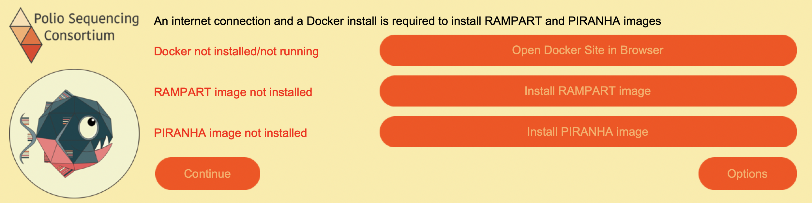
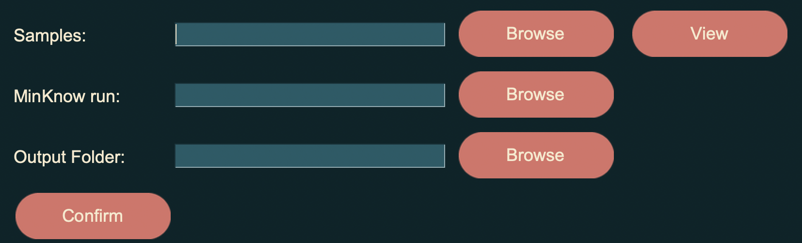
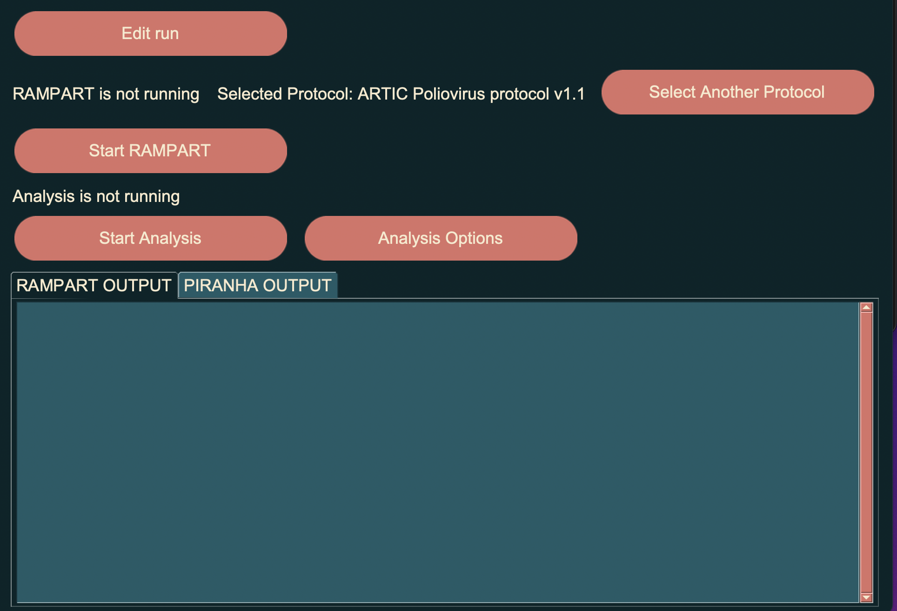

# PiranhaGUI

PiranhaGUI is a piece of software designed to provide a graphical user interface for running [PIRANHA](https://github.com/polio-nanopore/piranha). PiranhaGUI currently can also run [RAMPART](https://github.com/artic-network/rampart) It is being developed as part of the [Poliovirus Sequencing Consortium](https://polio-nanopore.github.io/). 
## Installation
PiranhaGUI may be installed on windows simply with an installer, downloadable from the [releases](https://github.com/polio-nanopore/piranhaGUI/releases) page.\
There is also a debian/ubuntu compatible .deb package available. It can installed using ubuntu inbuilt application installer GUI, or by running 
```
sudo apt install /path/to/file/piranhaGUI_1.4.0.deb 
```
There is also a zipped mac .app package bundle available to download.
## Usage
As a GUI tool piranhaGUI is intended to be intituitive to use but a guide is provided below nonetheless. If you find some element of the software's design particularly confusing, feel free to create an [issue](https://github.com/polio-nanopore/piranhaGUI/issues) on this repository.

On startup you should see the following window:



- The first of red text in this screenshot indicates docker is not running on this machine. If you see the same message the easiest way to resolve it is to install [docker desktop](https://docs.docker.com/get-docker/) on your machine, launch it, and restart Artifice. The text should have updated to indicate you have docker correctly installed.

Assuming you have docker ready to go, you can now pull the images for running RAMPART and PIRANHA from dockerhub by pressing the buttons provided. This requires an internet connection, the downloads at the time of writing are 200MB and 800MB respectively, so they shouldn't take too long even on a relatively slow connection.

From the startup screen you can also access the options menu by pressing the buttton labelled options. There are currenly two options available to modify. You can change the number of threads piranha will use for analysis, more threads will generally lead to faster results but increases the demand on your cpu. The default is half the number of threads available. You can also change the language from here, currently the options are french and english.

Pressing the continue button will take you to the window to setup/edit your run, shown below:



There are three fields to fill here, you can browse your OS file system for each them or simply copy in a path if you have it to hand. The first is samples, this is should be the csv file detailing your samples. Once you have selected your samples file you may want to view them with the provided button. This will open a window where you can select the column specifying the barcode and sample id, based on the label at the top of each column. For this reason piranhaGUI will not work as intended if your sample csv columns lacks labels.

The second field to fill is the MinKnow run folder. This should be the folder containing the demultiplexed samples outputed by MinKnow. Lastly the output folder field specifies where PIRANHA will place its' report files.

Once the run has been setup pressing continue will take you to the window for actually running RAMPART and PIRANHA analysis, shown below:



The first button will take you back to the previous window if you need to modify your run. Below there is an indicator for whether RAMPART is running, and what protocol is selected. There is also button for selected another protocol for RAMPART which will open a window for this purpose. piranhaGUI comes with two protcols to choose from, the ARTIC poliovirus protocol and the default RAMPART protocol. You can also add your own protocols if needed. 

Next there is button for starting RAMPART, if RAMPART is currently running there is also a button for viewing it in browser. There is a similar text indicator and button for running PIRANHA analysis. If PIRANHA has finished creating a report there will also be a button to view it in browser. There is also a button for configuring options specific to PIRANHA. Finally there are two tabs for selecting whether to view the text output either RAMPART or PIRANHA
