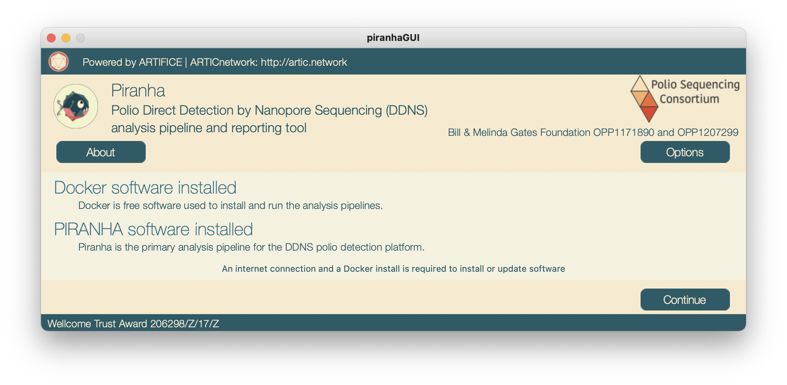
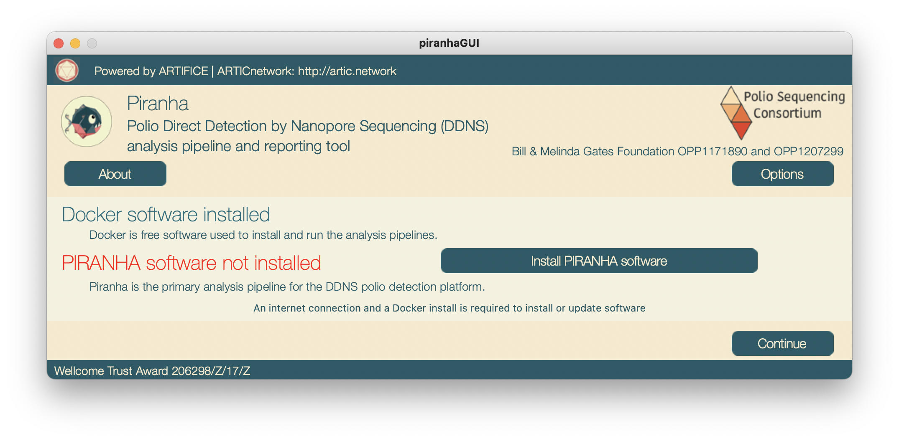
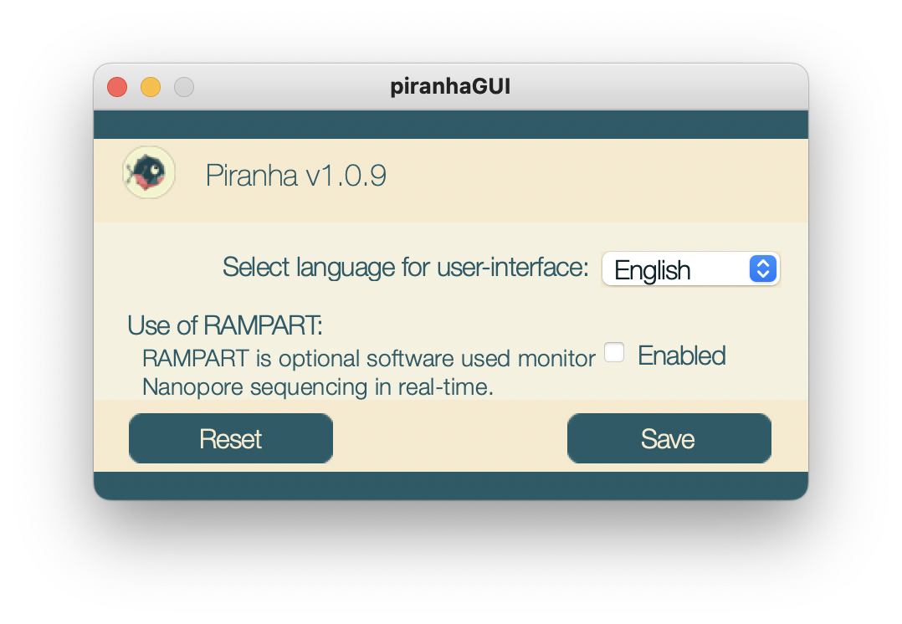
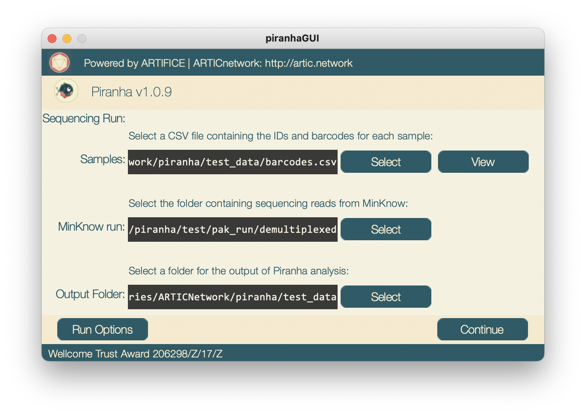
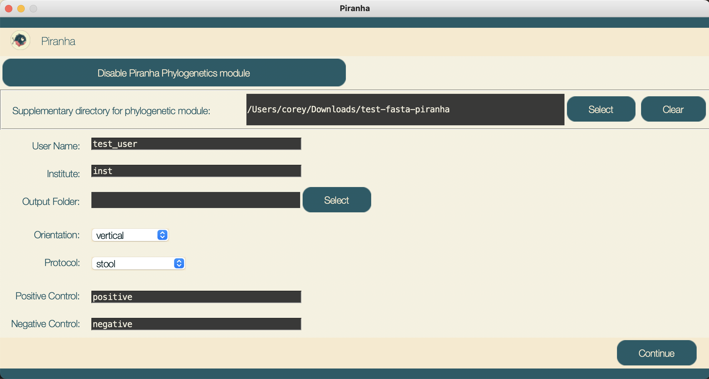
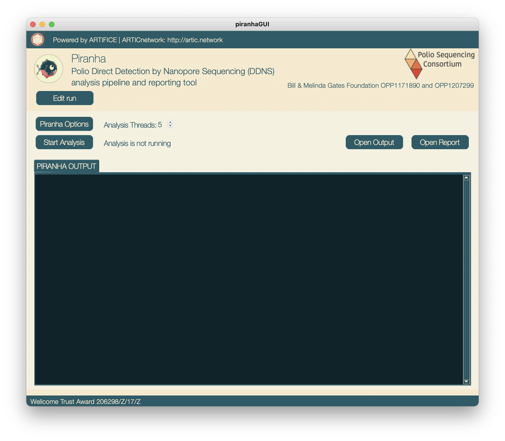

# PiranhaGUI

PiranhaGUI is a piece of software designed to provide a graphical user interface for running DDNS analysis pipeline, [PIRANHA](https://github.com/polio-nanopore/piranha). PiranhaGUI currently can also optionally run [RAMPART](https://github.com/artic-network/rampart) by [ARTIC](https://artic.network/). It is being developed as part of the [Poliovirus Sequencing Consortium](http://polionanopore.org). 

## Installation
PiranhaGUI may be installed on Mac, Windows or Linux, downloadable from the [releases](https://github.com/polio-nanopore/piranhaGUI/releases) page.
Installation instructions are on this page.

## Docker (or Docker Desktop)
In order to run PiranhaGUI you must first install and run a commercial (but free) software package called `Docker`. This sofware is creates individual and compartmentalised environments for installing and running other software - in this case the `Piranha` analysis pipeline. On a Windows or Mac, the easiest way to install it is to download `Docker Desktop` from [https://docs.docker.com/get-docker/](https://docs.docker.com/get-docker/) on your machine, install and run it. 

## Usage
Bugs and feature requests can be posted as ['issues' here](https://github.com/polio-nanopore/piranhaGUI/issues).

### Startup
On startup you will see a window that will tell you the status of the software packages required to run `Piranha`:

This is what the window is like if everything is ready to run. PiranhaGUI releases are packaged with the latest Piranha release which should install automatically when you first start the application, as long as Docker is in installed. However if Piranha or Docker is missing you may see one or more of the lines in red:

In this case it is saying that the `Piranha` sofware is not yet installed. Click the button to install it. Note that this may take some time depending on the internet connection (the download at the time of writing is 800MB). It is downloaded and installed into `Docker`.

From the startup screen you can also access the options menu by pressing the buttton labelled options. There are currenly two options available to modify. You can also change the language used in the Piranha output (and in the PiranhaGUI) from here -- currently the options are French and English. You can also choose to use the optional real-time sequencing monitoring sofware, RAMPART.  

### Setting up run
Pressing the `continue` button will take you to the window to setup/edit your run, shown below:

There are a number of fields to fill here, you can browse your OS file system for these three: 
- The first is samples, this is should be a csv file with at least two columns, matching each to sample to the corresponding barcode on each row. The first row should contain labels for eah column. Once you have selected your samples file you may want to view them with the provided button. This will open a window where you can select the column specifying the barcode and sample id, based on the label at the top of each column. 
- The second field to fill is the MinKnow run folder. This should be the folder containing the demultiplexed samples outputed by MinKnow. 
- Lastly the output folder field specifies where PIRANHA will place its' report files.
The remaining fields are optional in order to customise the report. If Run Name is left blank it will be set automatically according to the path of the MinKnow run folder

There are two separate options windows accessible from this window. The first is the persistent options, shown below. These options persist between runs, and allow you to provide supplementary sequences for the analysis. This allows you to set your own default options

With the buttion "Set options for this run" you can also set options for the analysis but these will not apply to future runs.

### Running Analysis
Once the run has been setup pressing continue will take you to the window for actually running RAMPART and PIRANHA analysis, shown below:

- The first button will take you back to the previous window if you need to modify your run. 
- Below there is an indicator for whether RAMPART is running, and what protocol is selected. There is also button for selected another protocol for RAMPART which will open a window for this purpose. piranhaGUI comes with two protcols to choose from, the ARTIC poliovirus protocol and the default RAMPART protocol. You can also add your own protocols if needed. 
- Next there is button for starting RAMPART, if RAMPART is currently running there is also a button for viewing it in browser. There is a similar text indicator and button for running PIRANHA analysis. If PIRANHA has finished creating a report there will also be a button to view it in browser. There is also a button for configuring options specific to PIRANHA. Finally there are two tabs for selecting whether to view the text output either RAMPART or PIRANHA
